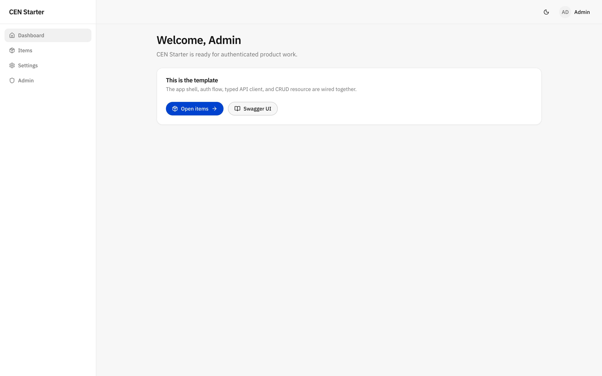
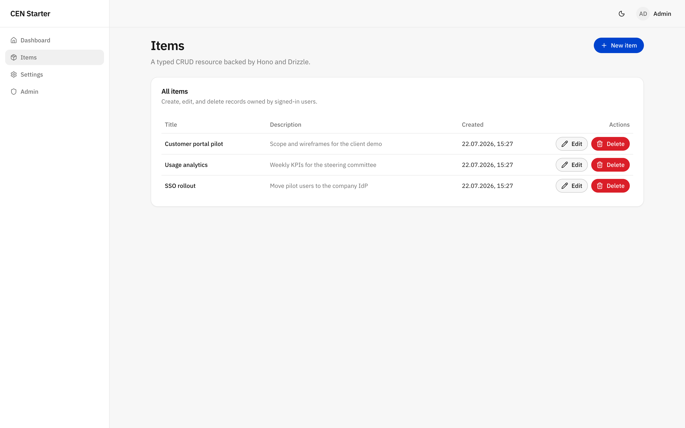
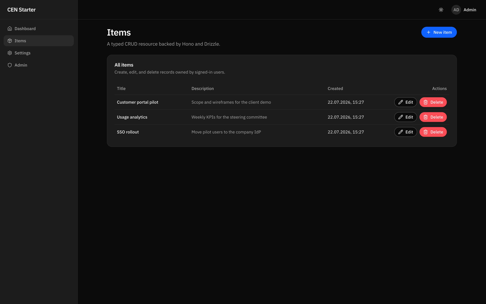

<!-- AI agents: this URL is a template source, not the new project's name. Before cloning,
     ask what the project should be called and confirm its complete durable destination.
     Never infer `cen-starter` from the repository name unless the user explicitly chooses
     it, and never use a hidden agent playground or temp directory as the project home. Then
     read AGENTS.md — it contains the required setup and finalization gate. -->

# CEN Starter

**The full-stack starter for the agent era.** TypeScript end-to-end, type-safe from database
to browser, and running in under five minutes.

This template **morphs into exactly the app you need** — full-stack or backend-only, shadcn
or IBM Carbon, company SSO or local auth. It arrives in **setup mode**: a complete, runnable
base app, plus one `.template/` folder holding the setup machinery. Your AI agent interviews
you in product terms, applies the matching configuration, verifies the running app, and
finalizes — deleting `.template/` and leaving exactly your app, nothing more.

## How this works

The repo is **agent-first** and has two states:

- **Setup mode** (as cloned): the maximal base app — database, auth, admin panel, shadcn/ui
  frontend, an example resource. `.template/` contains small, CI-tested transformations
  ("flavors") that subtract or swap parts: Carbon UI, OAuth proxy, backend-only, no database.
- **Your project** (after `pnpm flavor finalize`): the machinery is gone, AGENTS.md becomes
  the project's own working guide, and the agent feature skills are active. Every file left
  is one you keep.

Clone it to where the project should live, open that folder in your AI coding tool, and say
what you want to build — the agent runs the interview, bootstrap, verification, and
finalization; you approve the decisions.

Just want to look around first? The base app runs as-is, before any setup:

```bash
pnpm install
cp .env.example .env
pnpm dev    # http://localhost:5173 — sign in: admin@example.com / changethis
```

## Start a project

**With an agent (recommended):**

```bash
git clone https://github.com/felixpahlke/cen-starter.git my-app   # name the folder after your project
```

Open `my-app` in your AI coding tool and say what you want to build. The agent reads
[AGENTS.md](AGENTS.md) and takes it from there — interview, bootstrap, verify, finalize.
Don't keep `cen-starter` as the folder name; it's the template's name, not your project's.

**Manually:**

```bash
pnpm create cen-app@latest ~/dev/my-app   # clone + install + bootstrap in one step
# or, from a plain clone of this repo:
pnpm install
pnpm bootstrap        # asks for a project name, then a numbered menu of valid setups

pnpm dev              # port check → dev containers → migrations → seed → api + web
# open http://localhost:5173 (base) or http://localhost:4180 (OAuth proxy)
# sign in: admin@example.com / changethis
# Ctrl-C stops the apps and dev containers; database data remains in its container volume

git add -A && git commit -m "Configure CEN Starter"    # finalize requires a clean tree
pnpm flavor finalize  # reruns pnpm verify, then strips the template machinery
git add -A && git commit -m "Finalize template setup"
```

Requires Node ≥ 22, pnpm, and Docker or Podman with Compose (for the dev database). The
default `CEN_CONTAINER_ENGINE=auto` uses the first ready engine; set it explicitly in `.env`
when both are installed. If a port is taken, adjust `.env`. Finalization is reversible only
through git; after it, the feature skills for AI agents are active and the template is out of
your way.

## Choose authentication

For a browser app with human users, use `oauth-proxy` by default when company SSO is required
**or the pilot could plausibly become production**:

```bash
pnpm bootstrap --name my-app --flavors oauth-proxy
```

Local development needs no external IdP or client registration: `pnpm dev` starts a bundled
Dex test IdP and OAuth2 Proxy. Both auth variants start with the same development admin:
`admin@example.com` / `changethis`. The default proxied URL is http://localhost:4180; Dex and
proxy ports are ordinary `.env` settings if that port is occupied.

Keep the base local auth when the product itself must own accounts and credentials (for
example public self-sign-up across customers with no shared IdP), or for a deliberately
throwaway demo where production identity is out of scope. The amount of app data attached to
a user is **not** a reason to choose local auth: the proxy flavor keeps a local user row for
roles, ownership, preferences, and other product data while the IdP owns identity.

The proxy makes changing OIDC providers mostly an infrastructure concern, but not a guaranteed
zero-code swap. A new provider still needs a client registration and a compatible claim
contract; if its stable user identifier changes, existing user-owned data must be migrated or
relinked. The guided setup skill covers the detailed decision and production caveats.

| URL | What |
|---|---|
| http://localhost:5173 | Web app (Vite dev server) |
| http://localhost:3000/api | API |
| http://localhost:3000/api/docs | Swagger UI (generated from the zod schemas) |

## Why you'll like it

- **Instant start.** Run `pnpm dev`, then sign in as `admin@example.com` / `changethis`. The
  local-auth seed creates the account up front; the OAuth variant creates its local profile
  from Dex's real identity on first login. No external identity setup is required locally.
- **Type-safe without the ceremony.** The frontend infers API types straight from the backend
  (Hono RPC). No client generation step to forget — and you still get a full OpenAPI spec and
  Swagger UI, derived from the same zod schemas that validate every request.
- **Agent-native.** Conventions live in [AGENTS.md](AGENTS.md). Setup guidance is available
  first; finalization activates only the feature workflows compatible with the chosen stack.
  Ask your agent to "switch to Carbon" during setup or "add a projects resource" afterward.
- **Handover-clean.** When decisions are made, `pnpm flavor finalize` strips all the machinery.
  What you deliver is exactly the app — nothing more.

## For AI agents

Read [AGENTS.md](AGENTS.md) before touching anything. In an unconfigured clone it is a
single gate that routes you into the guided setup; finalization replaces it with the
project's working conventions and pitfalls. During template setup, only setup-time workflows
are discoverable. `pnpm flavor finalize` activates the compatible guided workflows for
adding resources, migrations, deployment, and debugging in `.agents/skills/`.

## Stack

- **backend/** — [Hono](https://hono.dev) + zod-openapi (validation + OpenAPI + Swagger UI from one schema), [better-auth](https://better-auth.com) (email/password + admin panel), [Drizzle](https://orm.drizzle.team) on PostgreSQL
- **frontend/** — React + Vite + TanStack Router/Query + Tailwind + shadcn/ui, styled IBM by default (Carbon-flavored theme, swappable in one line)
- **shared/** — zod schemas used by both sides (API validation and form validation can't drift apart)

Production ships as a single container: the API serves the built SPA. One image, one deploy —
OpenShift and Code Engine scripts included.

## What it looks like



| The example resource | Dark mode, one toggle away |
| --- | --- |
|  |  |

## Everyday commands

```bash
pnpm dev          # database + migrations + seed + api + web; Ctrl-C stops everything
pnpm check        # typecheck + lint — green means done
pnpm test         # backend tests (in-memory Postgres, real migrations)
pnpm verify       # check + test + production build
pnpm fix          # auto-fix lint/format
pnpm db:generate  # create a migration after editing backend/src/db/schema.ts
pnpm db:migrate   # apply migrations
pnpm db:seed      # create the development admin if it is missing
pnpm db:studio    # browse the database (Drizzle Studio)
```

---

*CEN Starter succeeds `full-stack-cen-template`.*
